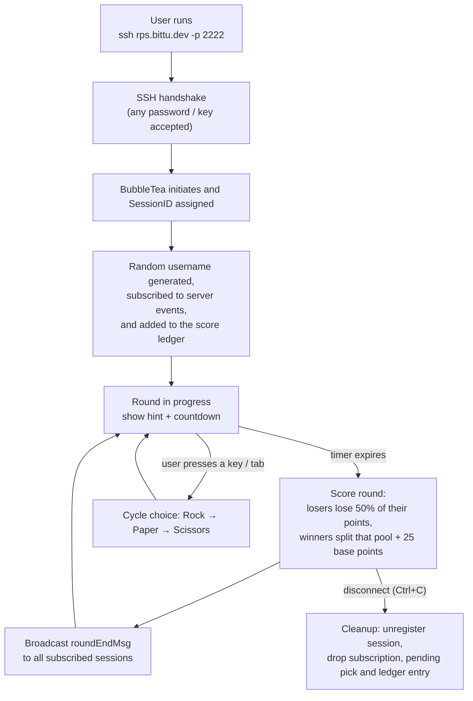

I have always been fascinated with TUI applications, so today I spent my time working on this little [Rock Paper SSH](https://github.com/Bittu5134/Rock-Paper-SSH) game. You can play it by using this SSH command:

```bash
ssh rps.bittu.dev -p 2222
```

# The gameplay

The gameplay is very minimal. You join the game, and the game picks Rock/Paper/Scissors and gives you a very obscure hint. You get 10 seconds to make your choice. If you beat the server, you win; otherwise, you lose 50% of your points, which get distributed to other winning players.

**Controls:** Press `TAB` or any other key to switch between Rock/Paper/Scissors.

>[!IMPORTANT]
> Due to network limitations, only people on an IPv6 network can connect to the server for now. Currently, I don't have the funds for an IPv4 server.

# The Backend

This project uses these three libs as its main components.
- [Wish](https://github.com/charmbracelet/wish)
- [BubbleTea](https://github.com/charmbracelet/bubbletea)
- [LipGloss](https://github.com/charmbracelet/lipgloss)

This works by hosting an SSH server first (using Wish). Then, after a user connects, a unique sessionID is assigned to the user, and a new BubbleTea TUI object is passed over to them, where the rest of the gameplay loop happens.

Here's the user flow:



The game natively handles window sizing, component placement, and proper colour support for different terminals using LipGloss (mentioned above).

Also, another goroutine maintains the game loop and decides when the round starts and ends. Players who have desynced are gracefully synced with the server clock.

This is the summary of how this little game works. You can check out the source code in this [GitHub repository](https://github.com/Bittu5134/Rock-Paper-SSH).


