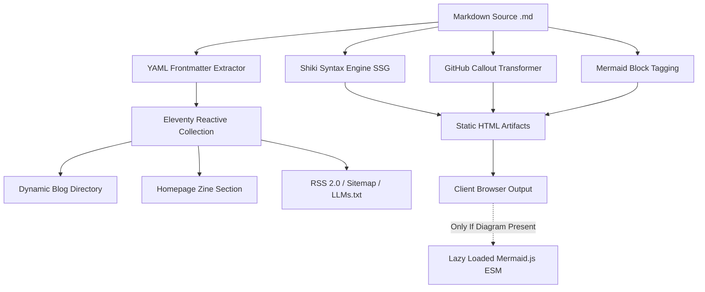
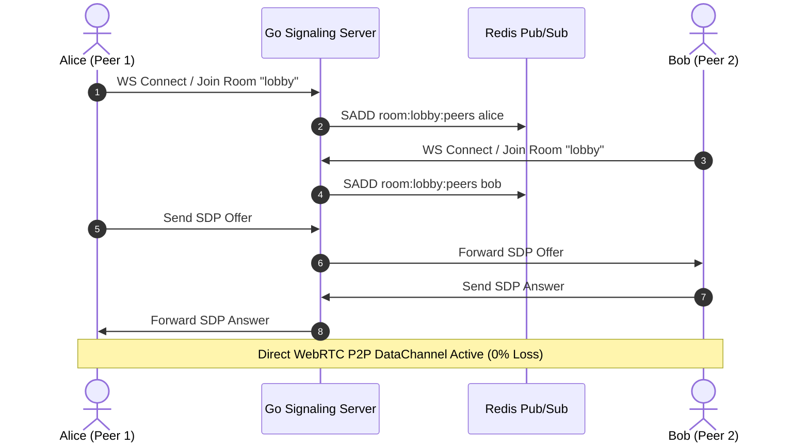
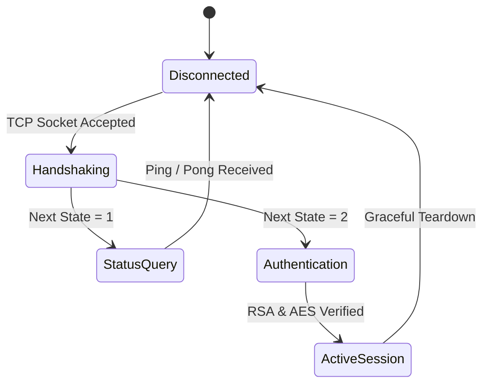

## 1. The Architecture of Our Blog Pipeline

Welcome to the engineering test dispatch for **bittu.dev**. This post acts as a live specification test harness for every frontend formatting feature supported across our static site generation pipeline.



> [!NOTE]
> All code highlighting is compiled statically **at build time** with Shiki. The browser downloads **0 KB** of client-side syntax highlighters.

---

## 2. GitHub Markdown Callouts

Our markdown parser automatically transforms GitHub Flavored Markdown alerts into styled neo-brutalist callouts with custom SVG icons and colored left borders.

### Standard Note Callout
> [!NOTE]
> Useful background information that users should know when skimming architecture documents or API specifications.

### Pro-Tip Callout
> [!TIP]
> Use Redis pipelines and connection pooling when dispatching heartbeat notifications across high-concurrency Goroutines to avoid TCP port exhaustion.

### Important Announcement
> [!IMPORTANT]
> The Handshake packet in Minecraft Java Edition dictates protocol state. Ensure variable-length integers are sanitized before memory allocation.

### Urgent Warning
> [!WARNING]
> PDF coordinate systems place origin `(0, 0)` at the bottom-left on Quartz engines and top-left on MuPDF engines. Normalize bounding boxes before clustering.

### Critical Caution
> [!CAUTION]
> Never expose raw Redis cluster administrative sockets to the public internet without strict mutual TLS authentication and IP whitelisting.

---

## 3. High-Throughput Code Highlighting (Shiki)

Every code block rendered below includes a terminal title bar, an active language badge, and a **one-click copy button** with instant clipboard feedback.

### Go Concurrency Worker
```go
package main

import (
	"context"
	"fmt"
	"sync"
	"time"
)

type WorkerPool struct {
	tasks chan func(ctx context.Context) error
	wg    sync.WaitGroup
}

func NewWorkerPool(workers int) *WorkerPool {
	p := &WorkerPool{
		tasks: make(chan func(ctx context.Context) error, workers*2),
	}
	for i := 0; i < workers; i++ {
		p.wg.Add(1)
		go p.worker(i)
	}
	return p
}

func (p *WorkerPool) worker(id int) {
	defer p.wg.Done()
	ctx := context.Background()
	for task := range p.tasks {
		if err := task(ctx); err != nil {
			fmt.Printf("[worker %d] task error: %v\n", id, err)
		}
	}
}
```

### Rust Zero-Copy Binary Buffer Reader
```rust
use std::io::{self, Cursor, Read};

#[derive(Debug)]
pub struct PacketHeader {
    pub length: u32,
    pub packet_id: u8,
}

pub fn parse_packet(buf: &[u8]) -> io::Result<PacketHeader> {
    let mut cursor = Cursor::new(buf);
    let mut len_bytes = [0u8; 4];
    cursor.read_exact(&mut len_bytes)?;
    
    let length = u32::from_be_bytes(len_bytes);
    let mut id_byte = [0u8; 1];
    cursor.read_exact(&mut id_byte)?;

    Ok(PacketHeader {
        length,
        packet_id: id_byte[0],
    })
}
```

### Python Spatial Coordinate Filter
```python
from dataclasses import dataclass
from typing import List

@dataclass
class BoundingBox:
    x0: float
    y0: float
    x1: float
    y1: float
    text: str

def cluster_spans(spans: List[BoundingBox], y_threshold: float = 3.0) -> List[List[BoundingBox]]:
    """Cluster 2D text bounding boxes into cohesive horizontal lines."""
    sorted_spans = sorted(spans, key=lambda s: s.y0)
    lines: List[List[BoundingBox]] = []

    for span in sorted_spans:
        y_mid = (span.y0 + span.y1) / 2
        assigned = False
        for line in lines:
            line_mid = sum((s.y0 + s.y1) / 2 for s in line) / len(line)
            if abs(y_mid - line_mid) <= y_threshold:
                line.append(span)
                line.sort(key=lambda s: s.x0)
                assigned = True
                break
        if not assigned:
            lines.append([span])

    return lines
```

### Shell Daemon Automation
```bash
#!/usr/bin/env bash
set -euo pipefail

NODE_ENV="production"
PORT=8080

echo "==> Starting WebRTC Signaling cluster on :${PORT}..."
exec ./bin/signaling-hub \
  --port="${PORT}" \
  --redis-addr="127.0.0.1:6379" \
  --max-peers=1000
```

---

## 4. Interactive Mermaid Diagrams

When a post contains diagrams, `mermaid.js` is **dynamically loaded** over ESM. If a page does not contain any diagram, **zero bytes** of the library are requested.

### Peer-to-Peer Signaling Sequence


### Protocol State Transition Diagram


---

## 5. Structured Data & Spec Matrix

Markdown tables are formatted with high-contrast borders and brutalist header banners.

| Component | Technology | Build Stage | Client Overhead |
|---|---|---|---|
| **Syntax Highlighter** | Shiki (`github-dark`) | SSG Pre-Compiled | **0 KB** (Pure HTML/CSS) |
| **Diagram Engine** | Mermaid v11 | Dynamic On-Demand | ~0 KB on text posts |
| **Callout Transformer** | Custom Token AST | SSG Pre-Compiled | 0 KB |
| **TOC Scroll-Spy** | `IntersectionObserver` | Client DOM Script | < 0.5 KB |
| **Progress Tracker** | Passive Scroll Window | Client DOM Script | < 0.2 KB |
| **Search & Filter** | Client Index Filter | Instant Vanilla JS | < 1.5 KB |

---

## 6. Checklist & Task Verification

- [x] Zero-dependency build pipeline configured in `.eleventy.js`
- [x] Shiki syntax highlighting verified across Go, Rust, Python, and Bash
- [x] Dynamic TOC sidebar with scroll-spy active indicator
- [x] On-demand conditional loading for Mermaid diagrams
- [x] Interactive real-time search and tag filtering on `/blog`
- [x] Automated RSS 2.0, Sitemap, and LLM text synchronization
