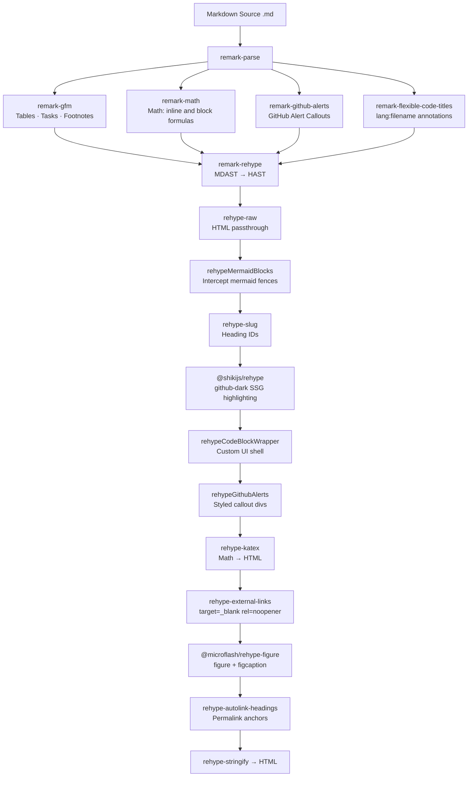
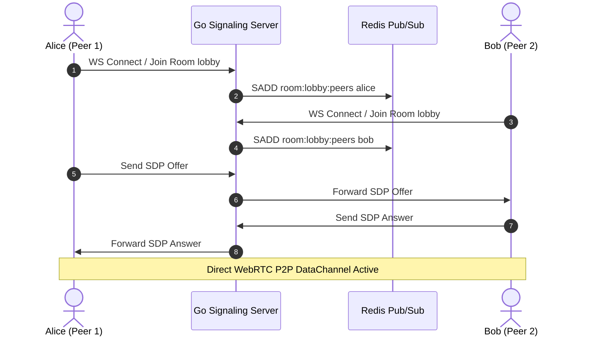

## 1. The Architecture of Our Blog Pipeline

Welcome to the engineering test dispatch for **bittu.dev**. This post acts as a live specification test harness for every frontend formatting feature supported across the unified remark + rehype pipeline.



> [!NOTE]
> All code highlighting is compiled statically **at build time** with Shiki. The browser downloads **0 KB** of client-side syntax highlighters.

---

## 2. GitHub Markdown Callouts

Our pipeline transforms GitHub Flavored Markdown alerts into styled callouts with colored left borders and custom SVG icons.

> [!NOTE]
> Useful background information that users should know when skimming architecture documents or API specifications.

> [!TIP]
> Use Redis pipelines and connection pooling when dispatching heartbeat notifications across high-concurrency Goroutines to avoid TCP port exhaustion.

> [!IMPORTANT]
> The Handshake packet in Minecraft Java Edition dictates protocol state. Ensure variable-length integers are sanitized before memory allocation.

> [!WARNING]
> PDF coordinate systems place origin `(0, 0)` at the bottom-left on Quartz engines and top-left on MuPDF engines. Normalize bounding boxes before clustering.

> [!CAUTION]
> Never expose raw Redis cluster administrative sockets to the public internet without strict mutual TLS authentication and IP whitelisting.

---

## 3. KaTeX Math Rendering

Inline math uses single dollar signs: $E = mc^2$ and $\sigma = \sqrt{\frac{1}{N}\sum_{i=1}^{N}(x_i - \mu)^2}$.

Display-level math uses double dollar signs and renders centered:

$$
\int_0^\infty e^{-x^2}\,dx = \frac{\sqrt{\pi}}{2}
$$

$$
\nabla \times \mathbf{B} = \mu_0 \mathbf{J} + \mu_0 \varepsilon_0 \frac{\partial \mathbf{E}}{\partial t}
$$

The Shannon entropy formula for a discrete probability distribution $P$:

$$
H(P) = -\sum_{x \in \mathcal{X}} P(x) \log_2 P(x)
$$

---

## 4. High-Throughput Code Highlighting (Shiki)

Every code block includes a language badge and a one-click copy button.

### Go Concurrency Worker

```go:worker_pool.go
package main

import (
	"context"
	"fmt"
	"sync"
)

type WorkerPool struct {
	tasks chan func(ctx context.Context) error
	wg    sync.WaitGroup
}

func NewWorkerPool(workers int) *WorkerPool {
	p := &WorkerPool{
		tasks: make(chan func(ctx context.Context) error, workers*2),
	}
	for i := 0; i < workers; i++ {
		p.wg.Add(1)
		go p.worker(i)
	}
	return p
}

func (p *WorkerPool) worker(id int) {
	defer p.wg.Done()
	ctx := context.Background()
	for task := range p.tasks {
		if err := task(ctx); err != nil {
			fmt.Printf("[worker %d] task error: %v\n", id, err)
		}
	}
}
```

### Rust Zero-Copy Binary Buffer

```rust:packet.rs
use std::io::{self, Cursor, Read};

#[derive(Debug)]
pub struct PacketHeader {
    pub length: u32,
    pub packet_id: u8,
}

pub fn parse_packet(buf: &[u8]) -> io::Result<PacketHeader> {
    let mut cursor = Cursor::new(buf);
    let mut len_bytes = [0u8; 4];
    cursor.read_exact(&mut len_bytes)?;
    let length = u32::from_be_bytes(len_bytes);
    let mut id_byte = [0u8; 1];
    cursor.read_exact(&mut id_byte)?;
    Ok(PacketHeader { length, packet_id: id_byte[0] })
}
```

### Python Spatial Coordinate Filter

```python:cluster.py
from dataclasses import dataclass
from typing import List

@dataclass
class BoundingBox:
    x0: float; y0: float; x1: float; y1: float; text: str

def cluster_spans(spans: List[BoundingBox], y_threshold: float = 3.0) -> List[List[BoundingBox]]:
    """Cluster 2D text bounding boxes into cohesive horizontal lines."""
    sorted_spans = sorted(spans, key=lambda s: s.y0)
    lines: List[List[BoundingBox]] = []
    for span in sorted_spans:
        y_mid = (span.y0 + span.y1) / 2
        assigned = False
        for line in lines:
            line_mid = sum((s.y0 + s.y1) / 2 for s in line) / len(line)
            if abs(y_mid - line_mid) <= y_threshold:
                line.append(span)
                line.sort(key=lambda s: s.x0)
                assigned = True
                break
        if not assigned:
            lines.append([span])
    return lines
```

### Dockerfile Multi-stage Build

```dockerfile:Dockerfile
FROM golang:1.23-alpine AS builder
WORKDIR /app
COPY go.mod go.sum ./
RUN go mod download
COPY . .
RUN CGO_ENABLED=0 GOOS=linux go build -ldflags="-s -w" -o signaling-hub ./cmd/server

FROM gcr.io/distroless/static:nonroot
COPY --from=builder /app/signaling-hub /signaling-hub
EXPOSE 8080
ENTRYPOINT ["/signaling-hub"]
```

### SQL Query with Window Functions

```sql:analytics.sql
WITH ranked_sessions AS (
  SELECT
    peer_id,
    room_id,
    connected_at,
    disconnected_at,
    EXTRACT(EPOCH FROM (disconnected_at - connected_at)) AS duration_s,
    ROW_NUMBER() OVER (PARTITION BY peer_id ORDER BY connected_at DESC) AS rn
  FROM peer_sessions
  WHERE connected_at > NOW() - INTERVAL '7 days'
)
SELECT peer_id, room_id, duration_s
FROM ranked_sessions
WHERE rn = 1
ORDER BY duration_s DESC
LIMIT 50;
```

---

## 5. Interactive Mermaid Diagrams

Mermaid.js is lazy-loaded via ESM **only on pages that contain diagrams**.

### Peer-to-Peer Signaling Sequence



### Protocol State Machine


---

## 6. GFM Tables

Markdown tables render with clean header rows and readable borders.

| Component | Technology | Build Stage | Client Overhead |
|---|---|---|---|
| **Syntax Highlighter** | Shiki (`github-dark`) | SSG Pre-Compiled | **0 KB** |
| **Diagram Engine** | Mermaid v11 | CSR On-Demand | ~0 KB on text posts |
| **Math Renderer** | KaTeX | SSG + CDN CSS | ~0 KB JS |
| **Callout Transformer** | rehype plugin | SSG Pre-Compiled | 0 KB |
| **TOC Scroll-Spy** | `IntersectionObserver` | Client Script | < 0.5 KB |
| **Search & Filter** | Vanilla JS | Client Script | < 1.5 KB |

---

## 7. Task Lists and Strikethrough (GFM)

- [x] Zero-dependency build pipeline in `.eleventy.js`
- [x] Shiki syntax highlighting across Go, Rust, Python, Bash
- [x] Dynamic TOC sidebar with scroll-spy active indicator
- [x] On-demand conditional Mermaid.js loading
- [x] KaTeX math rendering (inline + display)
- [x] GFM footnotes with backref links
- [x] Figure + figcaption from alt text
- [x] Code block filename titles via `lang:filename` syntax
- [x] External links with `rel="noopener noreferrer"`
- [ ] rehype-mermaid SSR (skipped — requires Playwright)

Strikethrough via `~~text~~`: ~~deprecated API endpoint~~ → use `/v2/rooms` instead.

---

## 8. Footnotes (GFM)

The Shannon entropy formula[^1] quantifies the average information content of a message. In distributed systems, Lamport timestamps[^2] provide a partial causal ordering without synchronized clocks.

[^1]: Claude Shannon, "A Mathematical Theory of Communication," *Bell System Technical Journal*, 1948.
[^2]: Leslie Lamport, "Time, Clocks, and the Ordering of Events in a Distributed System," *CACM*, 1978.

---

## 9. Figures and Image Captions

Images written as standalone paragraphs are automatically parsed into semantic `<figure>` elements, deriving a centered `<figcaption>` from the image's alt text:

