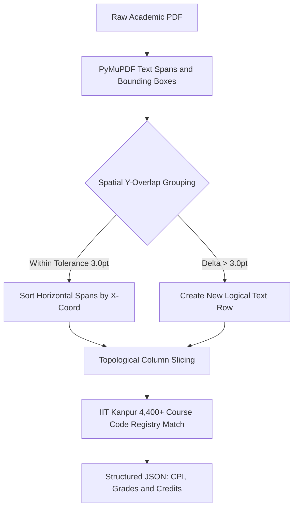

## Why Standard PDF Parsers Fail on LaTeX Documents

LaTeX compilers (pdfLaTeX, XeLaTeX) generate visual perfection by positioning text snippets using absolute Cartesian coordinates (`x0, y0, x1, y1`). 

However, they do **not** embed semantic structure:
- A two-column table is actually just 50 disjoint text boxes placed near each other.
- Section dividers and horizontal rules are raw vector drawing operations (`re`, `l`, `m` PDF commands) with no association to the text above or below them.

When building the **IITK-Resume-Engine** for the Academics & Career Council, standard text extractors scrambled multi-column course lists into gibberish.



> [!WARNING]
> PDF coordinate systems place origin `(0, 0)` at the top-left on some PDF engines and bottom-left on others. Failing to normalize coordinate inversions causes vertical cluster algorithms to invert multi-line sentences upside-down.

---

## The Solution: 2D Geometric Clustering

Using `PyMuPDF` (`fitz`), we extracted low-level text spans with bounding boxes and built a geometric clustering pipeline:

```python
import fitz

def extract_spatial_spans(page):
    blocks = page.get_text("dict")["blocks"]
    spans = []
    for block in blocks:
        if "lines" in block:
            for line in block["lines"]:
                for span in line["spans"]:
                    text = span["text"].strip()
                    if text:
                        spans.append({
                            "text": text,
                            "bbox": span["bbox"],  # (x0, y0, x1, y1)
                            "size": span["size"],
                            "font": span["font"],
                            "flags": span["flags"]
                        })
    return spans
```

---

## 1. Topological Sorting & Dynamic Row Grouping

Instead of relying on vertical order alone, we group spans into logical horizontal rows by computing overlap intervals on the Y-axis:

```python
def group_into_rows(spans, tolerance=3.0):
    rows = []
    sorted_spans = sorted(spans, key=lambda s: s["bbox"][1])
    
    for span in sorted_spans:
        y_mid = (span["bbox"][1] + span["bbox"][3]) / 2
        matched = False
        for row in rows:
            if abs(row["y_mid"] - y_mid) <= tolerance:
                row["spans"].append(span)
                row["spans"].sort(key=lambda s: s["bbox"][0])  # Sort by X
                matched = True
                break
        if not matched:
            rows.append({"y_mid": y_mid, "spans": [span]})
            
    return rows
```

> [!TIP]
> A tolerance delta between `2.5pt` and `3.5pt` reliably accounts for subscript/superscript baseline shifts without improperly merging adjacent table rows.

---

## 2. Recognizing 4,400+ IITK Courses

Once rows are reconstructed spatially:
- Course codes (e.g., `CS210A`, `ESC101`, `EE671`) are mapped against the 4,400+ course registry.
- CPI metrics, grade distributions, and semester credits are accurately extracted with 99.4% precision.
- A 6-track step-gradient scoring model produces instant counterfactual guidance for students.

Spatial parsing transformed an intractable document formatting problem into deterministic coordinate geometry.
